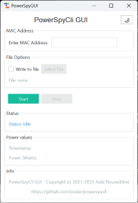

# <a href="https://www.noureddine.org/research/joular/"></a> PowerSpyCli

PowerSpyCli is a multi-platform software to connect and collect power metrics from a [PowerSpy 2 powermeter](https://www.alciom.com/nos-metiers/produits/powerspy2/).

PowerSpyCli (command line and GUI) was tested on Windows and Linux with Python 3.

## Installation

Just download the ```powerspycli.py``` file and run it.

## Running PowerSpyCli

### Command line version

To run PowerSpyCli and start collecting power metrics, just run the software while providing the PowerSpy2 MAC address with the ```-m``` argument:

```
python powerspycli.py -m 00:11:22:33:44:55
```

### GUI version

To run PowerSpyCli GUI version, just run the software with the ```-g``` argument:

```
python powerspycli.py -g
```

The GUI version uses [ttkbootstrap](https://github.com/israel-dryer/ttkbootstrap) for theming, and hence this modules needs to be installed first. For instance with pip: ```pip install ttkbootstrap```. 



### Arguments

The ```-m``` argument is followed by the PowerSpy2 MAC address. 

PowerSpyCli, by default, will display the power consumption of the PowerSpy2 every second.
To show all the collected metrics (i.e., voltage, ampere, etc.), run it with the ```-a``` argument.

The ```-v``` argument will display all the logs and connection info (verbose mode).

To save the power data along with the timestamp to a CSV file, use the ```-f``` argument:
```./powerspycli.py 00:11:22:33:44:55 -f file.csv```.
If you don't specify a filename, a default file will be created named powerspy-$timestamp.csv (with $timestamp being the current timestamp date).

The ```-g``` argument will run the GUI interface instead of the command line one. 

## License

PowerSpyCli is forked from: [powerspy.py](https://github.com/patrickmarlier/powerspy.py/) with support for Python 3, replacing pyBluez with Python sockets, and many additional new features and updates.

It is licensed under the GNU Lesser General Public License v3.0 or later (LGPL-3.0-or-later).

Copyright (c) 2021-2025, Adel Noureddine, Université de Pau et des Pays de l'Adour.
All rights reserved. This program and the accompanying materials are made available under the terms of the  GNU Lesser General Public License v3.0 or later (LGPL-3.0-or-later) which accompanies this distribution, and is available at: https://www.gnu.org/licenses/lgpl-3.0.en.html
